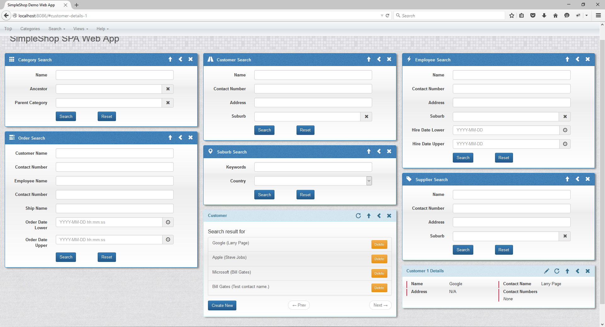

Simpleshop Single Page Web Application
=======

Summary
-----------
This is an experimental single page web application based on the libraries/frameworks below:

* Bootstrap
* jQuery
* AngularJS
* Spring Framework
* Drools - not added yet
* Hibernate
* H2 Database

The goal of this project is to create a framework which can quickly build a CRUD web application to a given domain. 

The page is divided into a menu area and a view area. The view area can display a list of views. Currently there are 5 types of views:
* Search view - provides a form to search for a type of objects
* List view - displays search results which is a list of objects; support paging and sorting of a single field.
* Details view - displays a single object in detail
* Update view - provides a form to update an object
* Create view - provides a form to create an object

Views have a model type, which is the type of model it can display.

Todo List
-----------
 * Check for modification before closing an edit/create view.
 * css/script bundling
 * Minification of sponge.js.
 * Display search criteria in the list view.
 * Display and upload of image.
 * Fix the many problems in error handling in JavaScript.
 * Improve validation messages.
 * Trim unnecessary parts of the request before posting json.
 * Add Spring Security.
 * Separate template and data. This way a type of template can be cached by the client.
 * Support full internationalization.

Future Todo List 
-----------
 * Replace boilerplate code with a Maven code generation plugin.

Limitations
-----------
The following architectural limitations are accepted and no attempt will be made to address them.

* The search framework cannot generate very sophisticated queries especially when there are nested OR and AND expressions.
* The 5 basic views display the associated type of domain object directly. Create a display view for a new view model if other types of query results are to be returned. These view models are considered read only. 
* To simplify things each view is independent. A view will not use any part of the model object of another view. 

